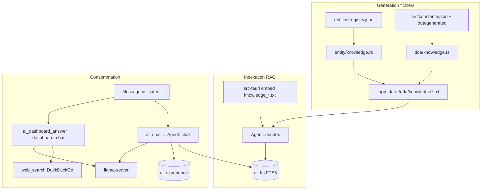

# Knowledge Loggy — fonctionnement côté code (Blin)

Document de référence pour **brief une autre IA** (ou un développeur) : comment la « mémoire » et le contexte métier sont produits, stockés, récupérés et injectés dans les réponses. Objectif : donner des **instructions actionnables** pour améliorer la **réactivité** et la **pertinence** des réponses sans casser l’architecture DDA / entités.

---

## 1. Vue d’ensemble (3 couches)

Blin ne fait **pas** d’embeddings vectoriels. Le « knowledge » repose sur :

| Couche | Stockage | Rôle |
|--------|----------|------|
| **A. Fichiers texte** | `{app_data}/dda/knowledge/*.txt` + fichiers embarqués Rust | Source de vérité **générée** (schémas, outils, entités) |
| **B. RAG FTS5** | SQLite `ai_chunks` + `ai_fts` | Recherche plein texte au moment du chat agent |
| **C. Expérience locale** | SQLite `ai_experience` | Réutilisation de requêtes passées → outils déjà réussis |

En plus (hors RAG strict) :

- **Résumé live** : comptages tables entités + stats legacy (`build_live_summary`)
- **Suggestions barre de commande** : `entities/dashboard_suggestions.json` (UI, pas injecté dans chaque message LLM)
- **Conversations** : `ai_conversations` / `ai_messages` (historique chat)



---

## 2. Chemins et fichiers clés

### 2.1 Données application (`{app_data}`)

Typiquement le répertoire Tauri `app_data_dir` (voir `Database::data_dir`).

| Chemin | Généré par | Contenu |
|--------|------------|---------|
| `entities/registry.json` | Utilisateur (Paramètres > Entités) | **Source de vérité** entités métier (type `stock` sur attributs ; **pas** d'entité `stock` manuelle) |
| `entities/dashboard_suggestions.json` | `entity/suggestions.rs` | Phrases « Gérer {label} » pour la barre de commande |
| `dda/generated/{nom}.json` | `entity/apply_registry` | Config DDA auto par entité |
| `dda/knowledge/MASTER_entities_schema.txt` | `entity/knowledge.rs` | Schéma + attributs de toutes les entités |
| `dda/knowledge/MASTER_entities_tools.txt` | idem | Exemples `dda_*` par entité |
| `dda/knowledge/{nom}_entity_schema.txt` | idem | Fiche par entité |
| `dda/knowledge/MASTER_entity_dashboard_suggestions.txt` | `entity/suggestions.rs` | Catalogue suggestions IA |
| `dda/knowledge/MASTER_stock_module.txt` | `entity/knowledge.rs` | Module stock (si attribut `stock` dans le registre) |
| `dda/knowledge/MASTER_stock_tools.txt` | idem | Commandes `entity_stock_*` + règles DDA stock |
| `dda/knowledge/MASTER_ia_*.txt` | `dda/knowledge.rs` | Agrégat écrans DDA legacy (tools, schema, media, layout) |
| `dda/knowledge/{screen}_tools.txt` etc. | `dda/knowledge.rs` | Par écran DDA synchronisé |
| `ai/internet.json` | Paramètres | `{ "enabled": true }` recherche web |

### 2.2 Code Rust (génération + index)

| Module | Fichier | Responsabilité |
|--------|---------|----------------|
| RAG | `src-tauri/src/ai/rag.rs` | Découpe en chunks 700 car., FTS5, `build_project_knowledge` |
| Agent | `src-tauri/src/ai/agent.rs` | `reindex()`, `chat()`, choix du contexte RAG |
| Entités | `src-tauri/src/entity/knowledge.rs` | TXT entités depuis registre |
| DDA | `src-tauri/src/dda/knowledge.rs` | TXT écrans DDA + MASTER |
| Expérience | `src-tauri/src/ai/experience.rs` | Mémoire outils réussis |
| Tableau de bord chat | `src-tauri/src/ai/dashboard_chat.rs` | **Sans RAG** — rapide / web / LLM léger |
| Intent | `src-tauri/src/ai/intent_filters.rs` | Détection liste, web, salutations, etc. |

### 2.3 Fichiers embarqués (compile time)

Indexés aussi dans le RAG via `build_project_knowledge` :

- `src-tauri/src/ai/knowledge_tools.txt`
- `src-tauri/src/ai/knowledge_schema.txt`
- `src-tauri/src/ai/knowledge_layout.txt`
- `README.md`, `.cursorrules` (si présents à la racine projet)

---

## 3. Quand le knowledge est régénéré / réindexé

### 3.1 Génération des `.txt` (disque)

| Événement | Code | Effet |
|-----------|------|--------|
| **Sauvegarde registre entités** | `commands/entity.rs` → `entity_registry_save` | `apply_registry` → `finalize_entity_knowledge` + `write_dashboard_suggestions_trigger` |
| **Sync DDA globale** | `dda/mod.rs` → `sync_all_screens` | `finalize_master_knowledge` + fichiers par écran |
| **Démarrage app** | `lib.rs` setup | `sync_all_screens`, `apply_registry`, puis `reindex_ai_knowledge` |

Ordre dans `entity_registry_save` :

1. Sauver `registry.json`
2. `apply_registry` (tables SQLite, JSON DDA, knowledge entités, suggestions)
3. **`dda::reindex_ai_knowledge`** → remplit FTS
4. Sync privilèges session

### 3.2 Réindexation FTS (`Agent::reindex`)

Fichier : `src-tauri/src/ai/agent.rs`

1. `DELETE` sur `ai_chunks` et `ai_fts`
2. Indexe `build_project_knowledge(project_root)` (JSON constante, README, knowledge_*.txt embarqués)
3. Parcourt **`{app_data}/dda/knowledge/*.txt`** et **`dda/validations/*.txt`**
4. Ajoute un chunk `donnees_live` = `build_live_summary()` (entités + stats dashboard)

**Commandes Tauri :**

- `ai_reindex` — manuel (Paramètres > bouton « Réindexer la mémoire IA »)
- Automatique si `SELECT COUNT(*) FROM ai_chunks = 0` au premier `ai_chat`

---

## 4. RAG : comment la recherche fonctionne

Fichier : `src-tauri/src/ai/rag.rs`

- **Chunk size** : 700 caractères (découpe naïve par caractères)
- **Requête FTS** : tokens alphanum ≥ 2 car., jointure **`OR`**, guillemets échappés (`build_fts_match_query`)
- **Limite** : max **8** chunks en SQL, l’agent n’en garde que **3** dans le prompt
- **Réécriture FTS (auto)** : `fts_rewrite::rewrite_user_query_for_fts` appelle llama-server (prompt court, max 96 tokens) **avant** `rag.search` ; fallback sur le message brut si échec ou 0 résultat

```rust
// agent.rs — extrait logique contexte
let fts_query = rewrite_user_query_for_fts(self.db, &effective);
let mut chunks = rag.search(&fts_query, 3).unwrap_or_default();
```

Fichier prompt : `src-tauri/src/ai/fts_rewrite.rs`. Les tokens `MASTER_entities_*` conservent les underscores (`rag.rs` → `sanitize_fts_token`).

Si FTS ne retourne rien → fallback **`build_live_summary()`** (pas les gros MASTER_*.txt).

**Important :** ce n’est pas une recherche sémantique ; les mots de la question doivent **chevaucher** le texte indexé.

---

## 5. Deux pipelines de réponse (ne pas confondre)

### 5.1 `ai_chat` — Agent complet (privilège `ai:utiliser`)

Point d’entrée : `commands/ai.rs` → `Agent::chat`

**Ordre de traitement** (réactivité = premiers matchs gagnent) :

1. Création conversation si besoin ; **auto-reindex** si `ai_chunks` vide
2. Enregistrement message user
3. Traduction réponse précédente (`translate.rs`) — sans LLM
4. Salutations (`greetings.rs`)
5. Réponses rapides heure/date/calcul (`quick_answers.rs`)
6. **Recherche web directe** si `wants_internet_research_intent` + Internet activé
7. Construction **contexte** :
   - Action métier (`wants_action_intent`) → **uniquement** `build_live_summary` (pas FTS doc)
   - Question Internet → texte fixe « pas de données métier locales »
   - Sinon → **RAG 3 chunks** ou live summary
8. **Hints expérience** (`format_experience_hints`, top 4, score ≥ 0.25)
9. Intents directs (delete, update, write, list, export, …) — **sans appel LLM**
10. **`try_experience_intent`** — réexécute un outil connu (score ≥ 0.38)
11. Sinon **LLM** + `system_prompt(rag_context, experience_hints)` + historique 12 messages
12. Parse JSON outil une ligne ; exécution ; `record_success` → `ai_experience`

### 5.2 `ai_dashboard_answer` — Chat accueil (léger)

Point d’entrée : `dashboard_chat.rs`

**Pas de RAG**, pas d’outils métier, pas d’expérience.

Ordre :

1. Traduction précédente
2. `try_quick_answer`
3. **Web** si intent + `ai/internet.json`
4. **`lightweight_llm_reply`** (prompt court, historique 8 messages, max 280 tokens)

→ Pour les questions « qui est X ? », la détection intent web est **critique** (`intent_filters.rs`).

---

## 6. Couche « expérience » (`ai_experience`)

Fichier : `src-tauri/src/ai/experience.rs`

- Après succès outil : `record_success(message, tool, params, outcome)`
- Normalisation message : `normalize_message` (minuscules, sans accents)
- Similarité : overlap de tokens, seuil **0.38** pour réutilisation directe
- Hints dans le prompt : seuil **0.25**, tri par score

**Limite :** apprentissage **local à la machine**, pas partagé entre utilisateurs.

---

## 7. Prompt système Agent (ce que le LLM voit)

Construit dans `Agent::system_prompt` :

- Identité Loggy + nom écosystème (`entity/branding`)
- Bloc architecture **entités** (registry, tableau de bord, `dda_*`, MASTER_entities_*)
- Règles JSON outil une ligne, interdiction LaTeX
- Bloc recherche Internet si activé
- **`experience_hints`** (optionnel)
- **`Contexte:`** + `rag_context` (≤ ~3 chunks ou live summary)

Le modèle local (Ministral 8B) a un contexte réduit (`LLAMA_CTX` = 2048) : trop de doc RAG = lenteur / hors sujet.

---

## 8. Instructions pour une IA « superviseur » (améliorer réactivité)

Copier-coller ou adapter ce bloc lors du brief.

### 8.1 Règles d’or du projet

1. **Ne pas** ajouter de texte métier en dur dans le front React pour Loggy.
2. **Toute** évolution schéma/outils entités → passer par **registre** + génération `dda/knowledge` + **`reindex`**.
3. Distinguer **`ai_chat`** (agent + RAG + outils) et **`ai_dashboard_answer`** (léger, web, pas RAG).
4. Préférer **intents directs** (`intent_filters.rs` + handlers dans `agent.rs`) avant d’enrichir le prompt LLM.
5. Le serveur **llama-server** est **lazy** : statut « Arrêté » en Paramètres jusqu’au premier `ensure_started`.

### 8.2 Quand modifier quoi

| Objectif | Fichier(s) à toucher |
|----------|----------------------|
| Nouvelle phrase déclenche liste/export/web | `intent_filters.rs` |
| Réponse immédiate sans LLM | Handler `try_direct_*` dans `agent.rs` ou `quick_answers.rs` |
| Doc visible par Loggy sur les entités | `entity/knowledge.rs` + trigger save registre |
| Doc écrans DDA legacy | `dda/knowledge.rs` + `sync_all_screens` |
| Meilleure recherche doc | `rag.rs` (chunk size, requête FTS, limite chunks) ou contenu des MASTER_*.txt |
| Réponses accueil plus smart | `dashboard_chat.rs` + intents web |
| Mémoriser actions répétées | `experience.rs` (seuils, champs indexés) |
| Forcer refresh mémoire | `ai_reindex` ou `entity_registry_save` |

### 8.3 Checklist réactivité (avant d’ajouter du RAG)

- [ ] La demande peut-elle être classée par **mot-clé normalisé** (`normalize_message`) ?
- [ ] Un **outil existant** dans `tools.rs` couvre-t-il déjà le cas ?
- [ ] Faut-il **court-circuiter le LLM** (comme listes → `build_live_summary` seul) ?
- [ ] Le message utilisateur déclenche-t-il **`wants_internet_research_intent`** (dashboard) ?
- [ ] Après changement registre, **`reindex_ai_knowledge`** est-il bien appelé ?
- [ ] Les fichiers `{app_data}/dda/knowledge/MASTER_entities_*.txt` existent-ils sur la machine test ?

### 8.4 Anti-patterns à éviter

- Indexer des milliers de lignes JSON brutes sans résumé → FTS bruité, LLM confus.
- Gros `rag_context` sur intents **action** (liste CRUD) → réponses hors sujet (déjà contourné dans `agent.rs`).
- Attendre le RAG sur le **tableau de bord** → il n’y est pas ; utiliser web ou intents.
- Oublier que FTS est **OR** sur tokens : requêtes trop courtes (« ok », « 5+6 ») → 0 chunk.

### 8.5 Tests manuels recommandés

1. Paramètres : Modèle présent, Binaire OK, **Démarrer serveur IA**.
2. `entity_registry_save` → vérifier présence de `MASTER_entities_schema.txt` dans `app_data`.
3. `ai_reindex` → nombre de fichiers > 0.
4. `ai_chat` : « gérer les tâches » → intent entité ou outil DDA, pas LaTeX.
5. `ai_dashboard_answer` : « cherche sur internet météo Paris » → web puis synthèse.
6. Répéter une même liste → vérifier croissance `ai_experience` / réutilisation.

---

## 9. Commandes Tauri utiles

| Commande | Rôle knowledge |
|----------|----------------|
| `entity_registry_save` | Régénère TXT entités + **reindex FTS** |
| `dda_sync_screens` | Régénère knowledge DDA + reindex (via commande dda) |
| `ai_reindex` | Réindexe FTS seulement |
| `ai_chat` | Consomme RAG + expérience + LLM |
| `ai_dashboard_answer` | Web / rapide / LLM léger, **sans RAG** |
| `ai_status` | Modèle, serveur, `experience_entries`, web on/off |

---

## 10. Schéma SQLite (extrait)

```sql
-- Chunks RAG
ai_chunks (id, source, content)
ai_fts USING fts5(chunk_id UNINDEXED, source UNINDEXED, content)

-- Expérience
ai_experience (message_norm, tool_name, params_json, summary, outcome, use_count, ...)

-- Conversations chat
ai_conversations, ai_messages
```

Migrations : `db_io.rs` (`migrate_v9`, `migrate_v11`).

---

## 11. Résumé une phrase

**Le knowledge Blin = fichiers TXT auto-générés (entités + DDA) → index FTS5 local → injectés dans le prompt de `ai_chat` avec expérience et intents directs ; le chat tableau de bord contourne le RAG et privilégie web + LLM léger.**

---

*Dernière mise à jour : aligné sur le code Blin (modules `ai/rag.rs`, `ai/agent.rs`, `entity/knowledge.rs`, `dda/knowledge.rs`, `dashboard_chat.rs`).*
